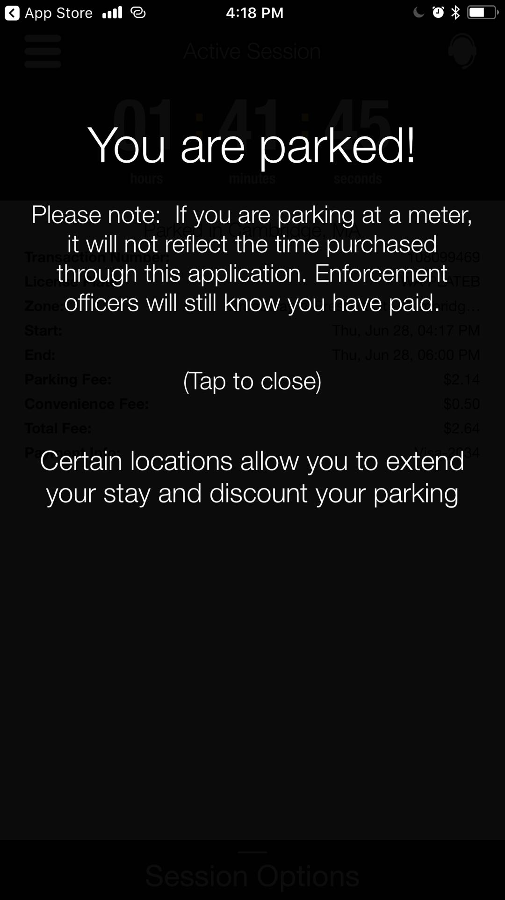
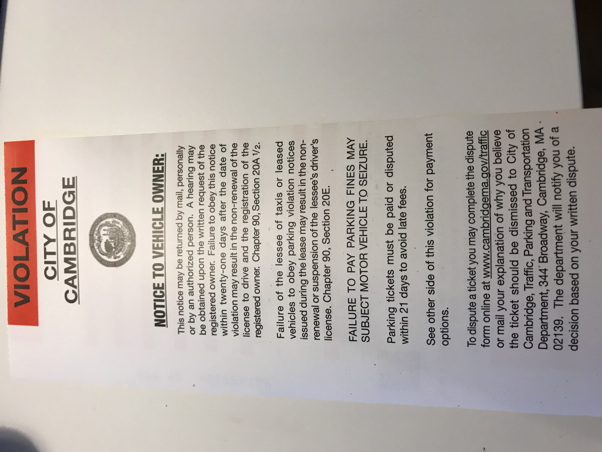
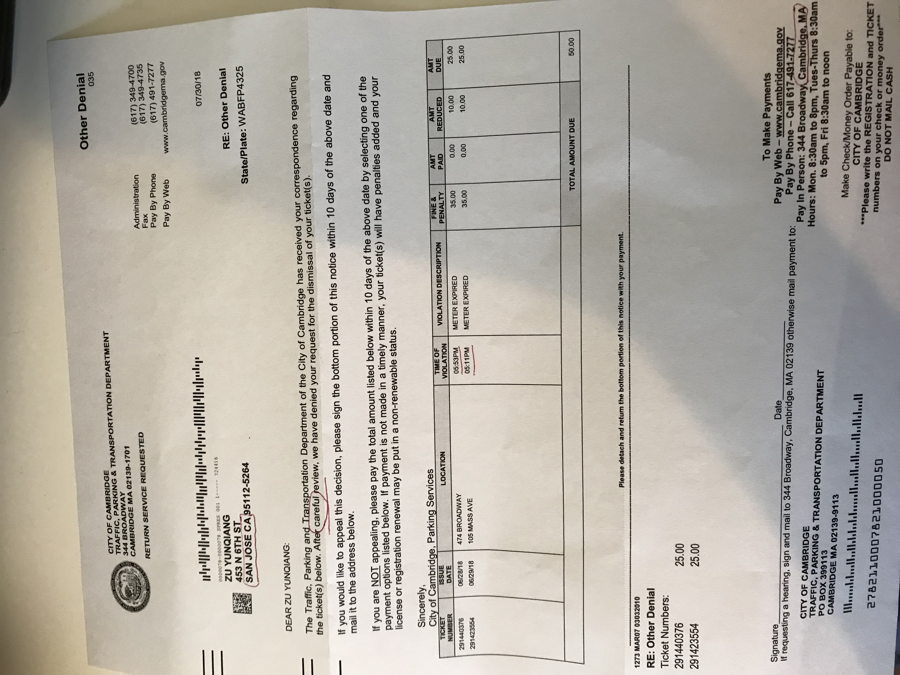

[TOC]

# Never trust the  PasspaortPaking  App and related stuff in Cambridge government

### Tickets on my car

Ticket number: 291440376

06/28/2018   ==5:53 PM==

474 Broadway

Zone: 2511

 

Ticket number: 291423554

06/28/2018   ==5:11 PM==

105 MASS AVE

Zone: 1557

 

### But I have paid them

The time slot I bought : 

Zone: 2511 Thu, Jun 28, ==04:17~ 06:00 PM==.  

Zone: 1557  Fri,  Jun 29, ==04:51~ 06:51 PM== .   2 hours . 

### Parker History provided by the PasspaortPaking  App

  

### My bank records

### An odd thing is

I paid them by PasspaortPaking App which name is in on the meter's description

  

 

### An odd notice

But after I paid I got an notice. 

 

by default I trust the  PasspaortPaking  App and related stuff in Cambridge government and did not worry more about it.

### What happened?   

The parking enforcers will ==never== see my mobile payment on their handheld device

I should not trust them

once I got the tickets I dispute these tickets and completed the dispute form online as the ticket said

I provided my paid records and still trust then can check them in there system. 

### They denied my correspondence after "carefull" review

### There is not any detailed info about why my dispute is denied. 

### What should I do? 

"if requesting a hearing, .... Cambridge, MA".

I am in San Jose, CA.  

##### My options: 

- request hearing:  cost will include time any payment for the plane tickets from CA to MA. I think they 

  find this when they "careful review"! 

- pay the "FINE":  That means I agree I did not pay those parking lots.  will Lost my reputation and good credit records history

  

#            ==I hate them, that is all==

# ==Reminder you: Do not get in their trap==

